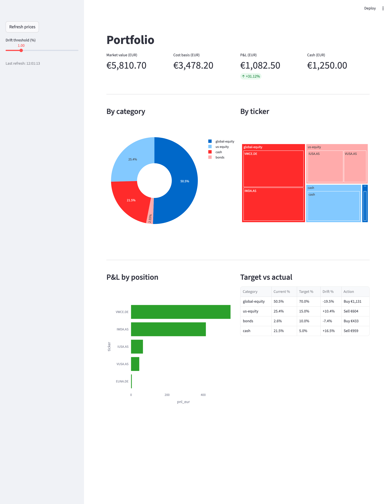

# portfolio

> A git-tracked, plain-text portfolio tracker for EU index investors — drift-to-target rebalancing in your terminal. No cloud, no broker login, no spreadsheet rot.

[](https://www.python.org/downloads/)
[](LICENSE)
[](#tests)

Buys and sells live in a CSV. Targets live in a YAML. Git is the audit trail. One command tells you exactly how much to buy or sell to hit your target allocation.



## Why not Ghostfolio / Portfolio Performance / a spreadsheet?

- **Plain-text, git-audited** — every trade is a diff, every rebalance is a commit. Nothing to back up, nothing to lose.
- **EUR-native, Trade Republic friendly** — enter the exact EUR you paid; no FX guesswork. USD trades auto-convert via historical FX.
- **Drift-to-target in one command** — tells you *"buy €1,130 of global-equity, sell €604 of us-equity"* instead of showing you a pie chart and leaving you to do arithmetic.
- **No server, no account, no tracking** — runs locally, reads public prices via yfinance. Your holdings never leave your laptop.
- **Tiny codebase** — ~500 lines of Python. Fork it, bend it to your life.

## Try it in 60 seconds

Requires Python 3.12+ and [uv](https://docs.astral.sh/uv/).

```bash
git clone <this-repo> && cd portfolio
uv sync --extra dev
uv run portfolio show
```

Seed data ships in `data/` — you'll see a sample portfolio and its drift out of the box. Replace with your own trades when you're ready.

### Sample output

```
TICKER            QTY    AVG EUR      PRICE    VALUE EUR    P&L EUR    P&L %
VWCE.DE       10.0000      98.50     153.66      1536.60     551.60   56.00%
IWDA.AS       12.0000      82.10     116.68      1400.10     414.90   42.11%
IUSA.AS       15.0000      55.80      60.20       903.06      66.06    7.89%
VUSA.AS        5.0000     105.40     114.52       572.58      45.58    8.65%
EUNA.DE       30.0000       4.80       4.95       148.36       4.36    3.03%

CATEGORY         CURRENT %   TARGET %    DELTA EUR
global-equity       50.54%     70.00%      1130.79
us-equity           25.40%     15.00%      -604.04
bonds                2.55%     10.00%       432.71
cash                21.51%      5.00%      -959.47
```

`DELTA EUR` is how much to buy (+) or sell (−) to hit your target weight.

## Daily use

```bash
# Record a buy (defaults to today, EUR)
uv run portfolio add-buy VWCE.DE 10 98.50

# USD trade — historical FX to EUR is fetched automatically
uv run portfolio add-buy VOO 5 420.00 --currency USD --date 2026-03-10

# Record a sell
uv run portfolio add-sell VWCE.DE 2 120.00

# Validate data files (CSV schema, ticker→category mapping, target weights sum to 1)
uv run portfolio check

# Terminal snapshot
uv run portfolio show

# Interactive dashboard
uv run streamlit run app.py
```

Override default paths with `--transactions path/to.csv` or `--config path/to.yaml`.

### Editing from the dashboard

The sidebar **Edit** expander lets you record buys/sells and edit cash, target weights, and tickers without hand-editing files. Changes write directly to `data/config.yaml` and `data/transactions.csv`; undo with `git restore data/`.

## Data model

Two files. That's it.

- **`data/transactions.csv`** — every buy and sell. For Trade Republic, enter `EUR_charged / quantity` as the price so no FX lookup is needed later.
- **`data/config.yaml`** — categories (global-equity, us-equity, bonds, cash…), which tickers belong where, target weight per category, and current cash balance.

Both are hand-editable. Run `uv run portfolio check` after manual edits. `git log data/` is your full history.

### Glossary

- **Category** — a bucket you want to target a weight for (e.g. `global-equity: 70%`).
- **Drift** — how far your current allocation is from target. The `show` table's `DELTA EUR` column quantifies it.
- **`.DE` / `.AS` tickers** — Xetra (Frankfurt) and Euronext Amsterdam listings, the EU-domiciled UCITS ETFs most Trade Republic users hold.

## Tests

```bash
uv run pytest
```

## License

MIT — see [LICENSE](LICENSE).

---

If this is useful to you, a ⭐ means a lot and helps others find it.
