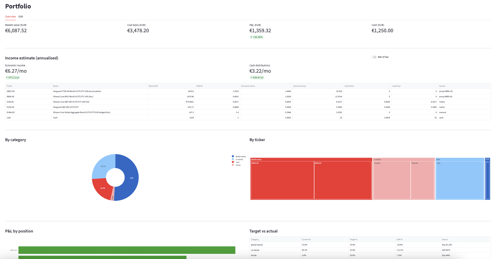

# portfolio

> Check, visualize, and rebalance your portfolio — from the terminal or an interactive dashboard. Plain-text, git-tracked, EU-native. No cloud, no broker login.

[](https://www.python.org/downloads/)
[](LICENSE)
[](#tests)

Buys and sells live in a CSV. Targets live in a YAML. Git is the audit trail. One command tells you exactly how much to buy or sell to hit your target allocation.



## Why not Ghostfolio / Portfolio Performance / a spreadsheet?

- **Plain-text, git-audited** — every trade is a diff, every rebalance is a commit. Nothing to back up, nothing to lose.
- **EUR-native, Trade Republic friendly** — enter the exact EUR you paid; no FX guesswork. USD trades auto-convert via historical FX.
- **Drift-to-target in one command** — tells you *"buy €1,130 of global-equity, sell €604 of us-equity"* instead of showing you a pie chart and leaving you to do arithmetic.
- **No server, no account, no tracking** — runs locally, reads public prices via yfinance. Your holdings never leave your laptop.
- **Tiny codebase** — ~850 lines of core Python (plus a Streamlit dashboard). Fork it, bend it to your life.

## Try it in 60 seconds

Requires Python 3.12+ and [uv](https://docs.astral.sh/uv/).

```bash
git clone <this-repo> && cd portfolio
uv sync --extra dev
uv run portfolio show
```

Seed data ships in `data/` — you'll see a sample portfolio and its drift out of the box. Replace with your own trades when you're ready.

### Sample output

```
TICKER            QTY    AVG EUR      PRICE    VALUE EUR    P&L EUR    P&L %
VWCE.DE       10.0000      98.50     153.66      1536.60     551.60   56.00%
IWDA.AS       12.0000      82.10     116.68      1400.10     414.90   42.11%
IUSA.AS       15.0000      55.80      60.20       903.06      66.06    7.89%
VUSA.AS        5.0000     105.40     114.52       572.58      45.58    8.65%
EUNA.DE       30.0000       4.80       4.95       148.36       4.36    3.03%

CATEGORY         CURRENT %   TARGET %    DELTA EUR
global-equity       50.54%     70.00%      1130.79
us-equity           25.40%     15.00%      -604.04
bonds                2.55%     10.00%       432.71
cash                21.51%      5.00%      -959.47
```

`DELTA EUR` is how much to buy (+) or sell (−) to hit your target weight.

## Daily use

```bash
# Record a buy (defaults to today, EUR)
uv run portfolio add-buy VWCE.DE 10 98.50

# USD trade — historical FX to EUR is fetched automatically
uv run portfolio add-buy VOO 5 420.00 --currency USD --date 2026-03-10

# Record a sell
uv run portfolio add-sell VWCE.DE 2 120.00

# Validate data files (CSV schema, ticker→category mapping, target weights sum to 1)
uv run portfolio check

# Terminal snapshot
uv run portfolio show

# Estimate income (dividends + cash interest), gross, annualised
uv run portfolio income
uv run portfolio income --net   # after German tax (rate + Teilfreistellung from config)

# Wipe and re-initialise config + transactions (interactive)
uv run portfolio init             # refuses if existing data is non-empty
uv run portfolio init --force     # overwrites; existing files renamed *.bak
# After init, assign tickers to categories via 'portfolio dashboard' (Tickers form)
# or by editing data/config.yaml — then add-buy works.

# Interactive dashboard
uv run portfolio dashboard
uv run portfolio dashboard --server.port 8502   # extra args pass through
```

Override default paths with `--transactions path/to.csv` or `--config path/to.yaml`.

### Editing from the dashboard

The sidebar **Edit** expander lets you record buys/sells and edit cash, target weights, and tickers without hand-editing files. Changes write directly to `data/config.yaml` and `data/transactions.csv`; undo with `git restore data/`.

### Importing transactions from a CSV

`portfolio import path/to/trades.csv` bulk-imports trades. On first run it walks
you through mapping your CSV's columns (date, ISIN, action, quantity, price,
currency), the decimal style, the date format, and which action words mean
buy/sell — saving that profile to `config.yaml`. Unknown ISINs are mapped to a
yfinance ticker once and remembered. Re-importing the same file is safe:
duplicate rows are skipped.

Flags: `--dry-run` (preview only), `--yes` (skip confirmation; requires all ISINs
already mapped), `--remap` (redo the column mapping).

### Income estimates

`portfolio income` estimates how much your portfolio earns, gross (pre-tax),
annualised and as a smoothed monthly run-rate. It reports **two** figures per
holding, because they differ:

- **Economic income** — what a holding *earns* (market value × yield), including
  income reinvested internally by accumulating ETFs.
- **Cash distribution** — what is actually *paid out* to you: dividends from
  distributing holdings + interest on your cash balance. Accumulating ETFs
  contribute €0 here.

Yields come from yfinance's trailing-12-month dividends. Accumulating ETFs
report ~0% there (they don't distribute), so for those you point at a
**distributing sibling** ("proxy") whose live yield stands in, or set a manual
yield. Configure this in `config.yaml`:

```yaml
cash_balance_eur: 11202.25
cash_interest_pct: 2.0          # interest your broker pays on cash (annual %)

income:                          # optional; omit a ticker to use its own live yield
  WEBG.DE: { proxy: VWRL.DE }    # accumulating → borrow a distributing twin's yield
  SXR8.DE: { proxy: VUSA.DE }
  EUNA.DE: { yield_pct: 2.4 }    # no live twin → manual annual yield %
  # VOW.DE, SHL.DE omitted → their own yfinance dividend yield is used
```

Each `income` entry sets **exactly one** of `proxy` or `yield_pct`. A holding
whose yield can't be resolved (e.g. a delisted proxy) is shown as `n/a`, counted
as €0, and flagged with a warning so the total is visibly incomplete. The same
breakdown appears in the dashboard's Overview tab and as a one-line summary at
the foot of `portfolio show`.

#### Net of tax

`portfolio income --net` (and a dashboard toggle) shows figures after a flat
German capital-income tax with per-holding **Teilfreistellung** (partial
exemption). Configure it under `tax:` — omit it for sensible defaults:

```yaml
tax:
  rate_pct: 26.375                 # Kapitalertragsteuer + Soli; ~27.8–28 with church tax
  default_teilfreistellung: equity # class for holdings not listed below
  teilfreistellung:
    VOW.DE: none                   # individual stocks & bond funds get no exemption
    SHL.DE: none
    EUNA.DE: none                  # equity ETFs inherit the 30%-exempt default
```

It's a rough estimate — it ignores the Sparer-Pauschbetrag allowance and the
accumulating-fund Vorabpauschale. Holdings left on the equity default that are
actually stocks or bond funds will overstate their net; the `tune-income` skill's
audit flags these.

## Data model

Two files. That's it.

- **`data/transactions.csv`** — every buy and sell. For Trade Republic, enter `EUR_charged / quantity` as the price so no FX lookup is needed later.
- **`data/config.yaml`** — categories (global-equity, us-equity, bonds, cash…), which tickers belong where, target weight per category, and current cash balance.

Both are hand-editable. Run `uv run portfolio check` after manual edits. `git log data/` is your full history.

A small price cache is written to `data/.price_cache.json` (gitignored, 10-minute TTL) so repeated `portfolio show` calls and dashboard reloads don't re-hit yfinance. Delete the file to force a fresh fetch.

### Glossary

- **Category** — a bucket you want to target a weight for (e.g. `global-equity: 70%`).
- **Drift** — how far your current allocation is from target. The `show` table's `DELTA EUR` column quantifies it.
- **`.DE` / `.AS` tickers** — Xetra (Frankfurt) and Euronext Amsterdam listings, the EU-domiciled UCITS ETFs most Trade Republic users hold.
- **Economic income vs cash distribution** — what a holding earns vs what it pays out. Accumulating ETFs earn income but distribute none. See [Income estimates](#income-estimates).
- **Income proxy** — a distributing sibling ETF used to estimate an accumulating fund's yield (its own is ~0% on yfinance).

## Tests

```bash
uv run pytest
```

## License

MIT — see [LICENSE](LICENSE).

---

If this is useful to you, a ⭐ means a lot and helps others find it.
